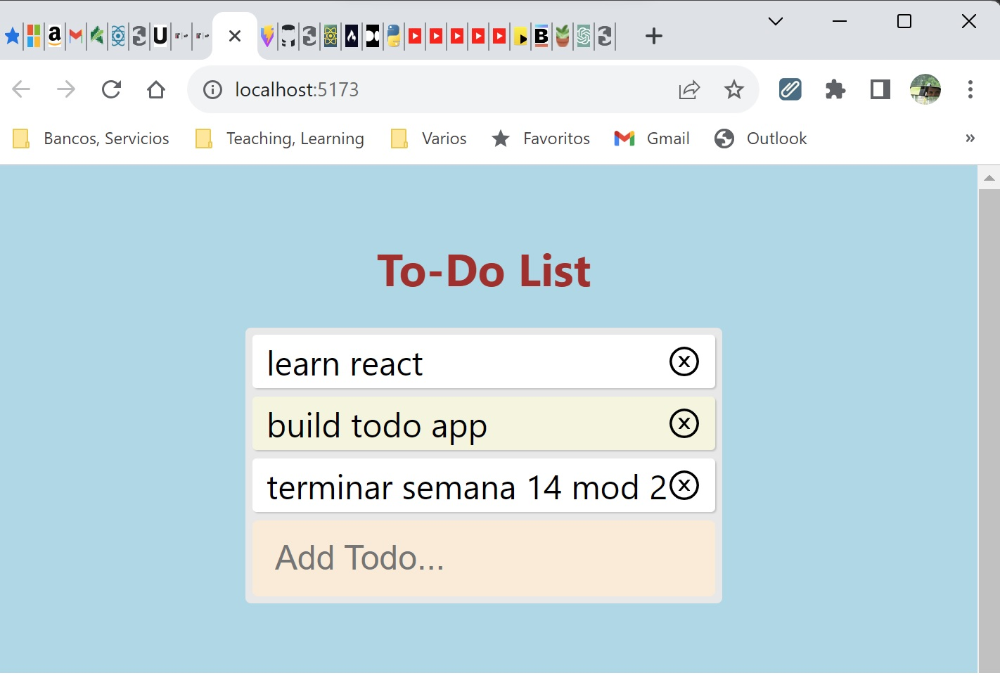

# ToDoList - David Silva

> :smile:**To Do List**
>
> *Hecha con React.js:*

>> Repositorio:




---

<div align="center" id="top"> 
  
  &#xa0;
</div>

<p align="center">
  
  
  
  
  
  
</p>

<p align="center">
  <a href="#dart-acerca">Acerca</a> &#xa0; | &#xa0; 
  <a href="#sparkles-caracteristicas">Caracteristicas</a> &#xa0; | &#xa0;
  <a href="#rocket-tecnologias>Tecnologias</a> &#xa0; | &#xa0;
  <a href="#white_check_mark-requerimientos">Requerimientos</a> &#xa0; | &#xa0;
  <a href="#checkered_flag-instrucciones">Instrucciones</a> &#xa0; | &#xa0;
  <a href="#memo-licencia">Licencia</a> &#xa0; | &#xa0;
  <a href="https://github.com/betoje" target="_blank">Autor</a>
</p>

---


## :dart: Acerca ##

TodoList

## :sparkles: Caracteristicas ##

TodoList hecha con: 

   :ballot_box_with_check: React.js

## :rocket: Tecnologias ##

Los siguientes lenguajes/herramientas fueron usados en este proyecto:

- JavaScript, HTML, CSS
- React.js
- Vite 

## :white_check_mark: Requerimientos ##

Antes de empezar :checkered_flag:, se necesita tener [Git](https://git-scm.com) instalado.

## :checkered_flag: Instrucciones ##

```bash
# Clone este proyecto
$ git clone https://github.com/betoje/0214-TodoList.git

# Acceda al directorio
$ cd 0214-TodoList

# Acceda a la terminal

# Instale las dependencias

# Arranque un servidor
```
## :memo: Licencia ##

Este proyecto está bajo la licencia de MIT. Para mayores detalles vea el archivo [LICENSE](LICENSE).

---

<!--
[](http://commonmark.org)
-->

  por <a href="https://github.com/betoje" target="_blank">David Silva</a>
 :heart: &#xa0;

<a href="#top">Regresar al inicio</a>
